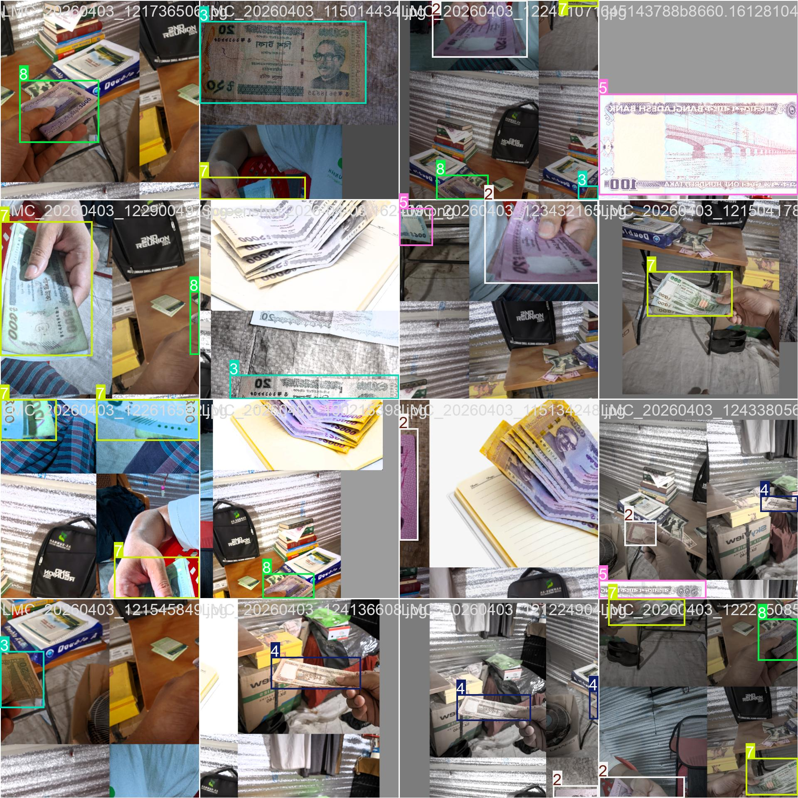
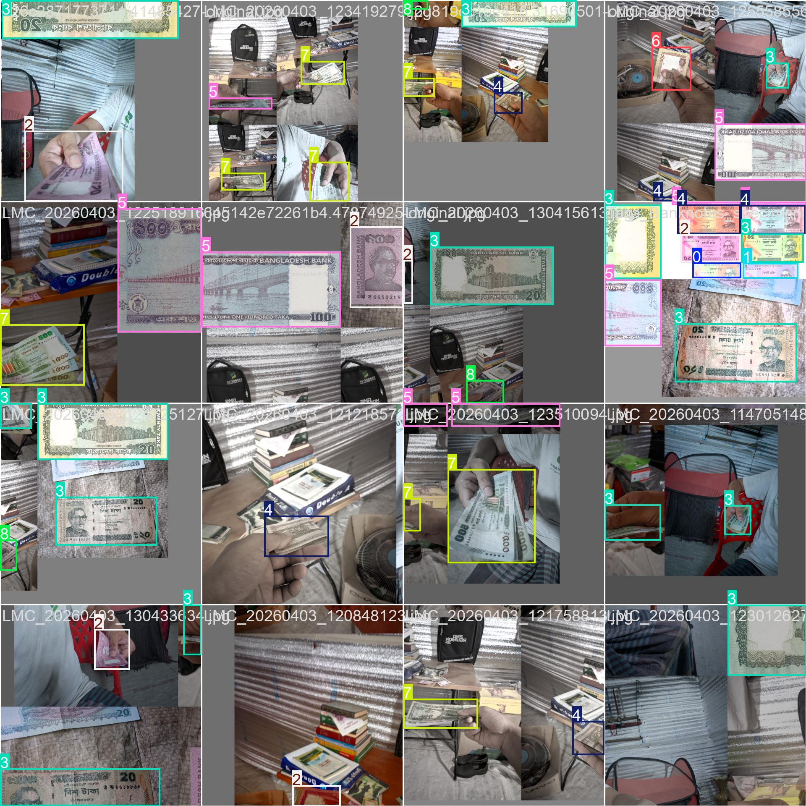
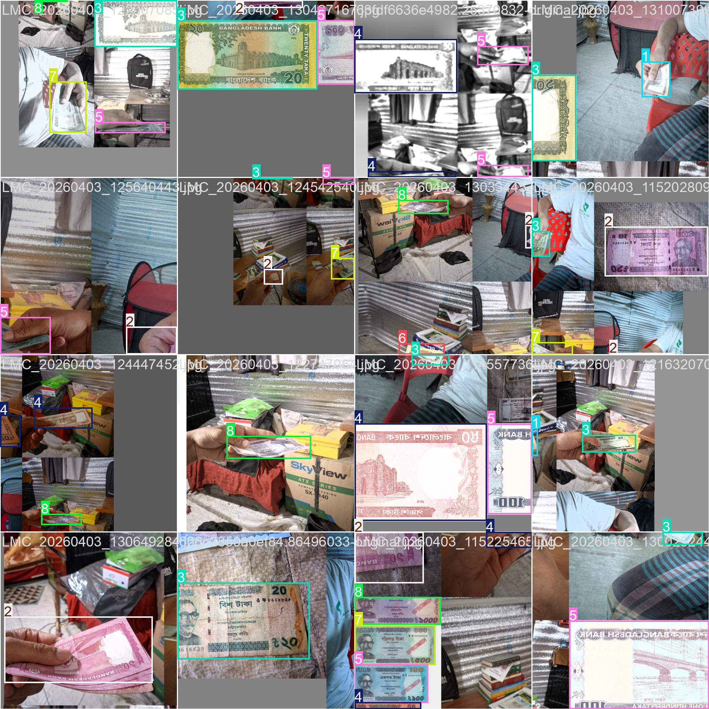
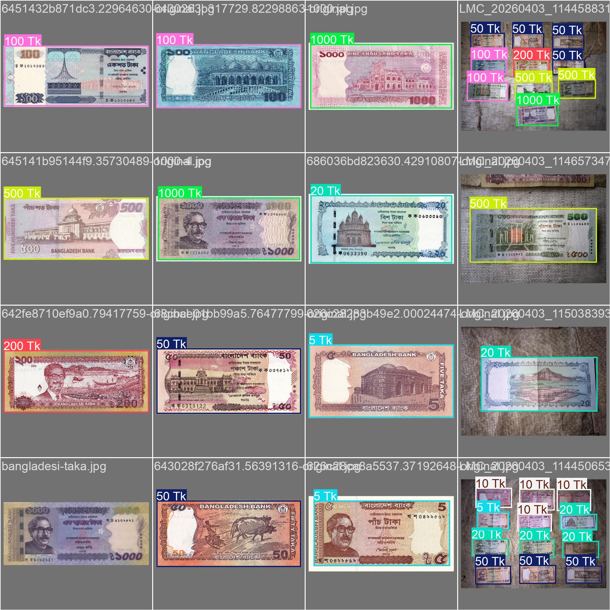
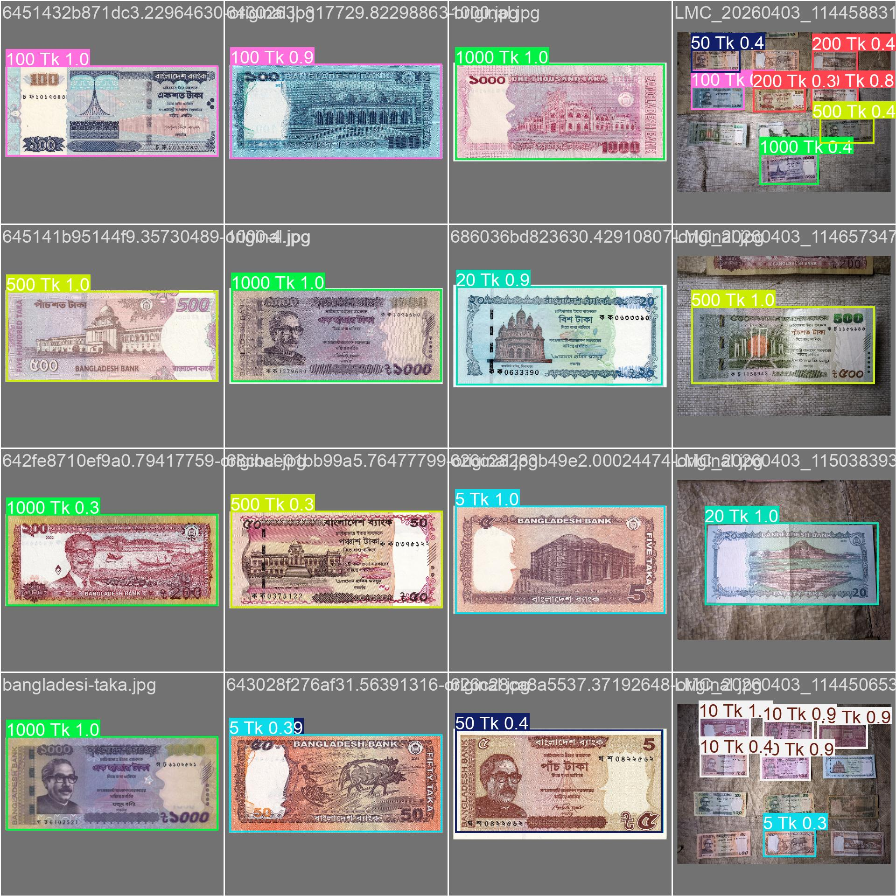
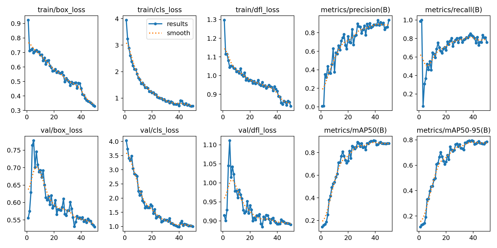
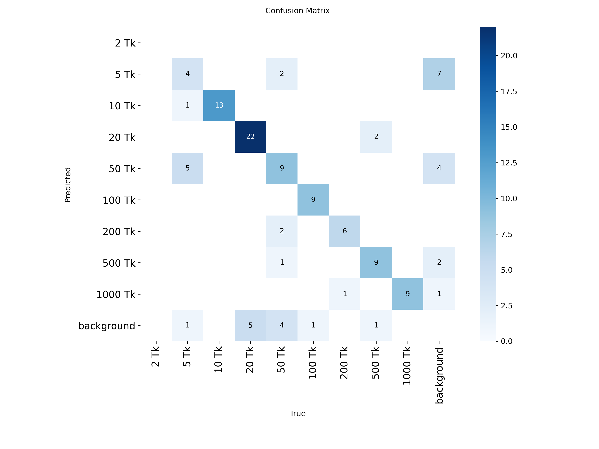
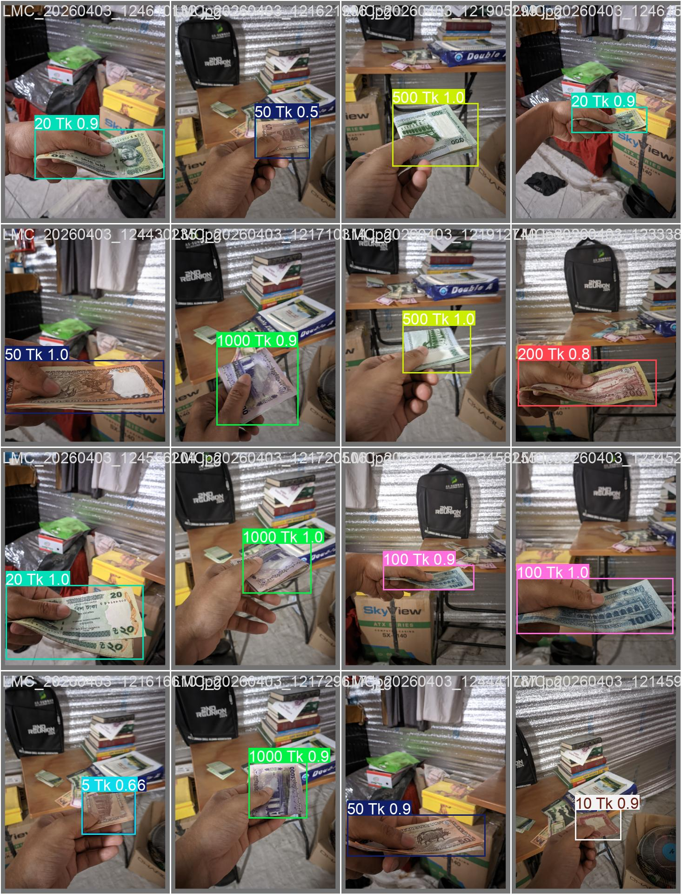

# 🇧🇩 Bangladeshi Taka Note Detection Using YOLOv8

[](https://www.python.org/)
[](https://github.com/ultralytics/ultralytics)
[](LICENSE)
[](YOUR_GOOGLE_DRIVE_LINK_HERE)
[](main.ipynb)

> **Module 16 Assignment** — Fine-tuning YOLOv8 to detect and classify all 9 denominations of Bangladeshi Taka currency notes in real-world conditions.

---

## 📌 Table of Contents

- [Project Overview](#-project-overview)
- [Dataset](#-dataset)
- [Dataset Structure](#-dataset-structure)
- [Sample Images](#-sample-images)
- [Model Training](#-model-training)
- [Training Batch Samples](#-training-batch-samples)
- [Model Evaluation](#-model-evaluation)
- [Results](#-results)
- [Installation & Usage](#-installation--usage)
- [Project Structure](#-project-structure)
- [Bonus: Coin Detection](#-bonus-coin-detection)
- [Acknowledgements](#-acknowledgements)

---

## 📖 Project Overview

This project fine-tunes a pretrained **YOLOv8n** model to detect and classify Bangladeshi Taka currency notes across **9 denominations**:

| # | Denomination | Class Label |
|---|---|---|
| 0 | 2 Taka | `2 Tk` |
| 1 | 5 Taka | `5 Tk` |
| 2 | 10 Taka | `10 Tk` |
| 3 | 20 Taka | `20 Tk` |
| 4 | 50 Taka | `50 Tk` |
| 5 | 100 Taka | `100 Tk` |
| 6 | 200 Taka | `200 Tk` |
| 7 | 500 Taka | `500 Tk` |
| 8 | 1000 Taka | `1000 Tk` |

---

## 📦 Dataset

### Collection

Images were collected from online sources and captured using a mobile phone camera, with intentional variation in:

- **Background** — plain, textured, and real-world surfaces
- **Lighting** — bright, dim, natural, and artificial light
- **Orientation & Scale** — flat, angled, rotated, and partially overlapping notes

### Download

📁 **[Google Drive Dataset Link](https://drive.google.com/drive/folders/1dBGFid98TA9eUwpCV_bSEdyw4DgCRWV6?usp=sharing)**

### Dataset Split Statistics

| Split | Folder | Approx. % |
|---|---|---|
| Training | `dataset/images/train/` | ~70% |
| Validation | `dataset/images/val/` | ~20% |
| Test | `dataset/images/test/` | ~10% |

### Annotation

All images were annotated using **[MakeSense.ai](https://www.makesense.ai/)** and exported in **YOLO format** (`.txt` files with normalized bounding boxes).

### `data.yaml`

```yaml
train: dataset/images/train
val:   dataset/images/val
test:  dataset/images/test

nc: 9
names: ['2 Tk', '5 Tk', '10 Tk', '20 Tk', '50 Tk', '100 Tk', '200 Tk', '500 Tk', '1000 Tk']
```

---

## 📁 Dataset Structure

```
dataset/
├── images/
│   ├── train/        ← Training images (~70%)
│   ├── val/          ← Validation images (~20%)
│   └── test/         ← Test images (~10%)
└── labels/
    ├── train/        ← YOLO .txt annotations for train
    ├── val/          ← YOLO .txt annotations for val
    └── test/         ← YOLO .txt annotations for test
```

Each label `.txt` file uses the YOLO format (one object per line):
```
<class_id> <x_center> <y_center> <width> <height>
```
All coordinates are normalized (0–1) relative to image size.

---

## 🖼️ Sample Images

### Training Set — Sample Per Denomination

| 2 Tk | 5 Tk | 10 Tk |
|:---:|:---:|:---:|
|  |  |  |

| 20 Tk | 50 Tk | 100 Tk |
|:---:|:---:|:---:|
|  |  |  |

| 200 Tk | 500 Tk | 1000 Tk |
|:---:|:---:|:---:|
|  |  |  |

---

### Validation Set — Sample Images

| Val Sample 1 | Val Sample 2 | Val Sample 3 |
|:---:|:---:|:---:|
|  |  |  |

---

### Test Set — Sample Images

| Test Sample 1 | Test Sample 2 | Test Sample 3 |
|:---:|:---:|:---:|
|  |  |  |

---

## 🏋️ Model Training

Training was done in **Google Colab** using `main.ipynb`. The model was fine-tuned from the pretrained `yolov8n.pt` checkpoint.

### Training Configuration

| Parameter | Value |
|---|---|
| Base Model | `yolov8n.pt` (pretrained on COCO) |
| Epochs | 50 |
| Batch Size | 16 |
| Image Resolution | 640 × 640 |
| Number of Classes | 9 |
| Framework | Ultralytics YOLOv8 |

### Training Code

```python
from ultralytics import YOLO

model = YOLO('yolov8n.pt')

results = model.train(
    data='data.yaml',
    epochs=50,
    imgsz=640,
    batch=16,
    name='train'
)
```

---

## 🏷️ Training Batch Samples

YOLOv8 automatically saves batch visualizations during training. These show how annotated currency notes were fed to the model.

### `train_batch0.jpg` — Batch 0 (Ground Truth Labels)


### `train_batch1.jpg` — Batch 1 (Ground Truth Labels)


### `train_batch2.jpg` — Batch 2 (Ground Truth Labels)


---

### Validation Batch — Ground Truth vs Model Predictions

| `val_batch0_labels.jpg` (Ground Truth) | `val_batch0_pred.jpg` (Predictions) |
|:---:|:---:|
|  |  |

---

## 📊 Model Evaluation

The trained model was evaluated on the held-out **test set**:

```python
from ultralytics import YOLO

model = YOLO('runs/detect/train/weights/best.pt')
metrics = model.val(data='data.yaml', split='test')

print(f"mAP50:    {metrics.box.map50:.4f}")
print(f"mAP50-95: {metrics.box.map:.4f}")
print(f"Precision:{metrics.box.mp:.4f}")
print(f"Recall:   {metrics.box.mr:.4f}")
```

### Evaluation Metrics (Test Set)

| Metric | Score |
|---|---|
| mAP@0.5 | _(fill after evaluation)_ |
| mAP@0.5:0.95 | _(fill after evaluation)_ |
| Precision | _(fill after evaluation)_ |
| Recall | _(fill after evaluation)_ |

---

## 📈 Results

### Training & Validation Curves


### Confusion Matrix


### Precision-Recall Curve


### F1 Score Curve


### Sample Test Detections (with Bounding Boxes)

| Prediction 1 | Prediction 2 |
|:---:|:---:|
|  |  |

---

## ⚙️ Installation & Usage

### 1. Clone the Repository

```bash
git clone https://github.com/somairhossain/Bangladeshi-Taka-Note-Detection-Using-YOLOv8.git
cd Bangladeshi-Taka-Note-Detection-Using-YOLOv8
```

### 2. Install Dependencies

```bash
pip install ultralytics opencv-python matplotlib pandas numpy PyYAML
```

### 3. Download the Dataset

Download from [Google Drive](YOUR_GOOGLE_DRIVE_LINK_HERE) and extract into the `dataset/` folder.

### 4. Train the Model

```bash
python -c "
from ultralytics import YOLO
model = YOLO('yolov8n.pt')
model.train(data='data.yaml', epochs=50, imgsz=640, batch=16)
"
```

Or open `main.ipynb` directly in Google Colab.

### 5. Run Inference on Test Images

```bash
yolo detect predict \
  model=runs/detect/train/weights/best.pt \
  source=dataset/images/test/ \
  conf=0.5 \
  save=True
```

---

## 🗂️ Project Structure

```
Bangladeshi-Taka-Note-Detection-Using-YOLOv8/
│
├── dataset/
│   ├── images/
│   │   ├── train/              # Training images
│   │   ├── val/                # Validation images
│   │   └── test/               # Test images
│   └── labels/
│       ├── train/              # YOLO annotations for train
│       ├── val/                # YOLO annotations for val
│       └── test/               # YOLO annotations for test
│
├── runs/
│   └── detect/
│       └── train/
│           ├── weights/
│           │   ├── best.pt     # Best model checkpoint
│           │   └── last.pt     # Last epoch checkpoint
│           ├── train_batch0.jpg
│           ├── train_batch1.jpg
│           ├── train_batch2.jpg
│           ├── val_batch0_labels.jpg
│           ├── val_batch0_pred.jpg
│           ├── confusion_matrix.png
│           ├── results.png
│           ├── PR_curve.png
│           ├── F1_curve.png
│           └── results.csv
│
├── data.yaml                   # Dataset configuration
├── yolov8n.pt                  # Pretrained YOLOv8n base model
├── main.ipynb                  # Full Colab training notebook
└── README.md
```

---

## 🪙 Bonus: Coin Detection

As an optional extension (15 bonus marks), the model is retrained to also detect Bangladeshi coins:

| Denomination | New Class Label |
|---|---|
| 2 Taka Coin | `2 Tk Coin` |
| 5 Taka Coin | `5 Tk Coin` |

**Steps:**
1. Collect and annotate coin images.
2. Update `data.yaml` → set `nc: 11` and add coin class names.
3. Fine-tune from the already-trained `best.pt`:

```python
model = YOLO('runs/detect/train/weights/best.pt')
model.train(
    data='data_with_coins.yaml',
    epochs=30,
    imgsz=640,
    batch=16,
    name='train_with_coins'
)
```

Updated evaluation results and inference samples for coin detection are in `runs/detect/train_with_coins/`.

---

## 🙏 Acknowledgements

- [Ultralytics YOLOv8](https://github.com/ultralytics/ultralytics) — model architecture & training framework
- [Roboflow](https://roboflow.com/) — dataset annotation & management
- [MakeSense.ai](https://www.makesense.ai/) — alternative annotation tool
- Bangladesh Bank — reference images for currency denominations

---

## 📬 Contact

**Author:** Somair Hossain  
**GitHub:** [@somairhossain](https://github.com/somairhossain)

---

*Submitted as part of Module 16 Assignment — Object Detection using YOLOv8*
